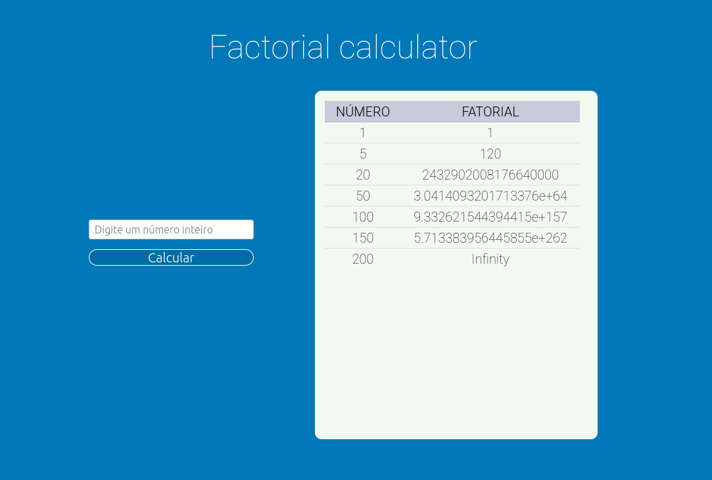

# Factorial Calculator

Factorial Calculator é uma aplicação desenvolvida em Spring Boot e ReactJS que tem por objetivo receber um valor inteiro e retornar o seu fatorial.

## Pré requisitos

- Docker v19 ou superior
- Docker compose v1.27 ou superior

## Instalação

- Após fazer o download do arquivo, faça a extração
- Dentro da pasta, execute o comando

    `docker-compose up`

Após realizada todas as instalações, acesse o seguinte endereço no seu navegador

`http://localhost:3000`

Pronto! a calculadora já está rodando em sua máquina!

---

## Principais tecnologias

Tendo em vista as especificações do projeto, toda a etapa de cálculo do fatorial deve ser feita pelo backend da aplicação, além desta dever ser codificada em Java.

### Spring Boot
Este é um framework Java que facilita a criação de aplicações backend. Necessário justamente por receber as requisições POST feitas pelo frontend em React.

### React
Foi utilizado para oferecer uma interface amigável e trabalhar com tudo que não seja calcular o fatorial. Exemplos:

- Fazer a validação dos dados antes de ir para o backend da apliação
- Renderizar uma lista com o histórico dos cálculos realizados

### Docker

Docker é um conjunto de produtos que usa a virtualização do sistema operacional para distribuir em pacotes chamados containeres. Isto permite que o ambiente todo seja portável para qualquer outro host que tenha o Docker instalado.