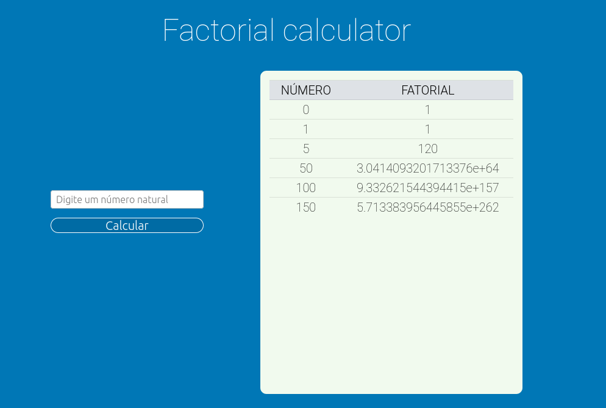

# Factorial Calculator

Factorial Calculator é uma aplicação desenvolvida em Spring Boot e ReactJS que tem por objetivo receber um valor inteiro e retornar o seu fatorial.



## Pré requisitos

- Docker v19 ou superior
- Docker compose v1.27 ou superior

Caso não tenha o docker instalado, [clique aqui](https://docs.docker.com/get-docker/) para obtê-lo. Você também precisará instalar o [docker compose](https://docs.docker.com/compose/install/).

## Instalação

- Faça a cópia do repositório com o comando abaixo ou faça o download e extração da pasta.

    `git clone https://github.com/LeonardoNunes19/factorial-calculator-fullstack.git`

- Certifique-se de que as portas 3000 e 8080 não estão sendo utilizadas na sua máquina

- Dentro da pasta, execute o comando

```
docker-compose build
docker-compose up
```

Após realizada todas as instalações, acesse o seguinte endereço no seu browser

`http://localhost:3000`

Pronto! a calculadora já está rodando em sua máquina!


## Principais tecnologias

Tendo em vista as especificações do projeto, toda a etapa de cálculo do fatorial deve ser feita pelo backend da aplicação, além desta dever ser codificada em Java.

### Spring Boot
Este é um framework Java que facilita a criação de aplicações backend. Necessário justamente por receber as requisições POST feitas pelo frontend em React.

### React
Foi utilizado para oferecer uma interface amigável e trabalhar com tudo que não seja calcular o fatorial. Exemplos:

- Fazer a validação dos dados antes de ir para o backend da apliação
- Renderizar uma lista com o histórico dos cálculos realizados

### Docker

Docker é um conjunto de produtos que usa a virtualização do sistema operacional para distribuir em pacotes chamados containers. Isto permite que o ambiente todo seja portável para qualquer outro host que tenha o Docker instalado.

## Contato

Leonardo Vieira Nunes - leonardovnun@protonmail.com

Link do repositório - https://github.com/LeonardoNunes19/factorial-calculator-fullstack